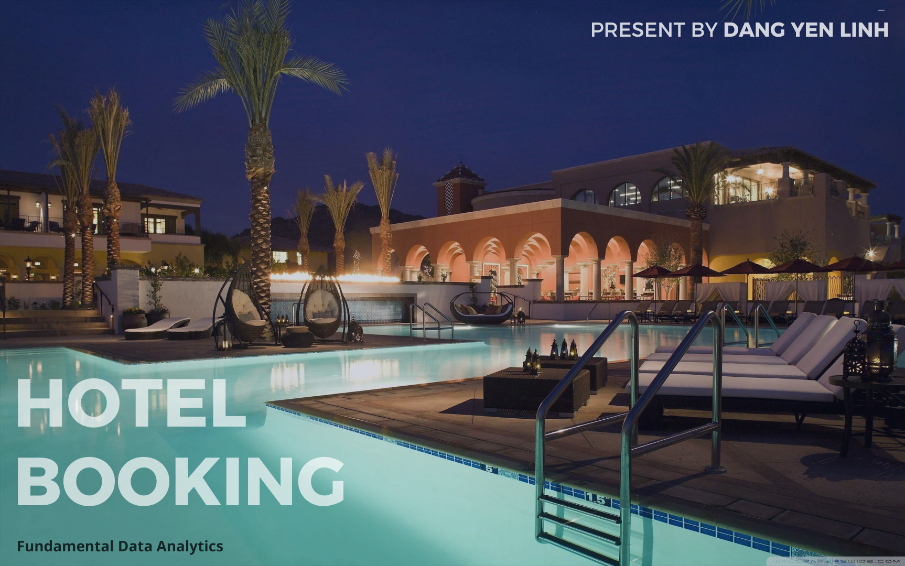

# Hotel Booking Analysis

 **Author**: Dang Yen Linh

**Email**: dangyenlinhh@gmail.com

**Linkedln**: https://www.linkedin.com/in/dangyenlinhh/

**Presentation video**: [Hotel Booking Analysis presentation](https://www.youtube.com/watch?v=TQRR0950vJE&t=418s)

*Explore the full interactive experience and uncover hidden insights in my dashboards by visiting **My Tableau Public link**. Thank you!*

# Project overview
This project utilized **Tableau Prep** for data preprocessing, and **Tableau Desktop** for creating storytelling including dashboards illustrating booking and cancellation trends, analyzing cancellation reasons, and providing forecasts for the upcoming year. In addition, I also proposed solutions to increase the number of bookings and minimize cancellations.

# About Dataset 

This dataset contains 87396 observations for a City Hotel and a Resort Hotel. Each observation represents a hotel
Booking between the 1st of July 2015 and the 31st of August 2017, including bookings that effectively arrived and bookings that were canceled.

The data is originally from the article [Hotel Booking Demand Dataset](https://www.sciencedirect.com/science/article/pii/S2352340918315191), written by Nuno Antonio, Ana Almeida, and Luis Nunes for Data in Brief, Volume 22, February 2019.

The data I used in this project was adjusted by Th.S Doan Thi Tram.

# Task 1: Data Preparation

Bỏ ảnh tableau prep vào

liệt kê làm gì 

# Task 2: Data Visualization and Storytelling

### Objectives
- Develop a dashboard
- Analyze the results and provide recommendations to clients.

## Result 

Summary of the target of the hotel 
# ảnh 1

Let's start with observation-created dashboards illustrating booking and cancellation trends, analyzing cancellation reasons, and providing forecasts for the upcoming year.

# ảnh 2

The data set includes bookings from July 2015 to the end of August 2017. In order to provide an overview of the hotel's business situation during the year, the above dashboard was built to provide some information :

- The rate of total booking of City Hotel and Resort Hotel.
- The number of cancellation rates and confirmation rates.
- The rate of old guests, new guests as well as customer type distribution.
- Monitor total bookings and cancellations trends
- Most country guests are from because each country has different cultural and culinary characteristics.

# ảnh 3
The dashboard above provides detailed information about:
- The difference in the total bookings, cancellations, confirmations, and total stays between the current year and the previous year.
- Average daily rate trends per month.
- Understanding guest preferences: couples, families, singles.
- Some demands of guests such as: stay nights, meal, reserver room

Besides that, I also analyzed details about cancellations, causes of cancellations, as well as demand of guests. 
# ảnh 4

# ảnh 5
# ảnh 6

## Recommendation

For more details, check out this video presented by me:  [Hotel Booking Analysis presentation](https://www.youtube.com/watch?v=TQRR0950vJE&t=418s)

# ảnh youtube
  

